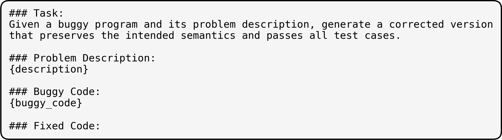
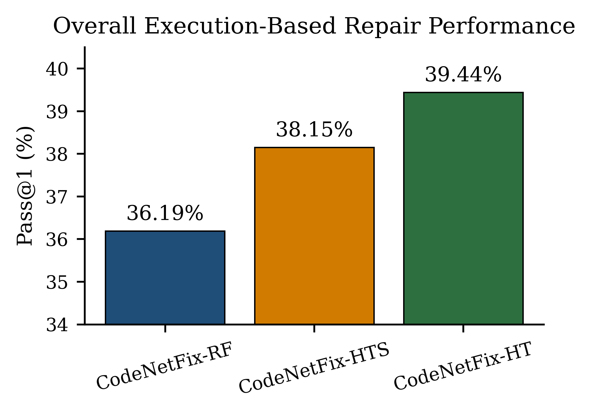
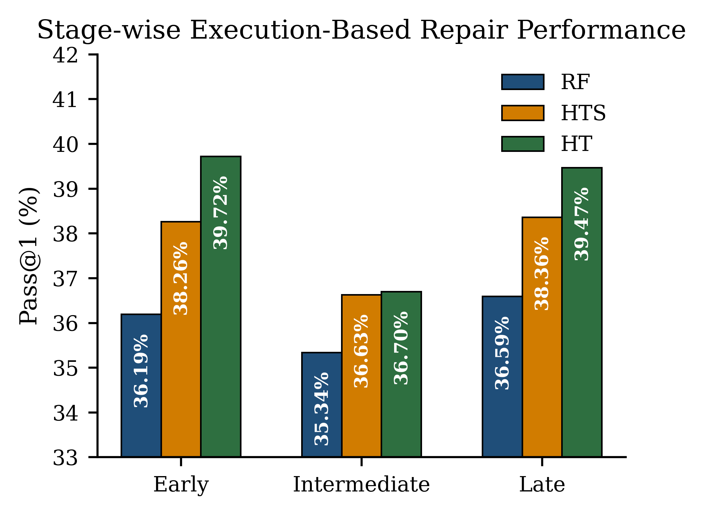
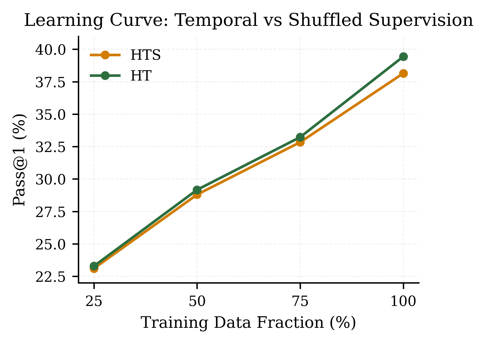

# On the Role of Temporal Structure in Historic Repair Trajectories for Automatic Program Repair

This repository accompanies the paper:

**On the Role of Temporal Structure in Historic Repair Trajectories for Automatic Program Repair**

This work studies whether **preserving the chronological order of human debugging attempts improves neural Automatic Program Repair (APR).**

Most APR datasets treat bugs as **single buggy–fix pairs**, ignoring the iterative nature of human debugging. However, programmers usually refine programs through **multiple submissions before reaching a correct solution**.

This project leverages **historic repair trajectories** mined from **Project CodeNet** to investigate whether **temporal ordering provides additional learning signal for neural repair models.**

---

# Key Idea

Human debugging is inherently **iterative**.

Example repair trajectory:

Submission 1 → Wrong Answer
Submission 2 → Time Limit Exceeded
Submission 3 → Accepted

Each step represents a **progressively refined program**.

We hypothesize that **preserving this temporal structure improves neural repair models beyond simply increasing dataset size.**

---

# Repair Trajectory Illustration

Below is an example illustrating how programmers progressively refine solutions through multiple submissions.

  

  <em>
    Example of a temporally ordered historic repair trajectory for a fixed 
(u_i, p_j, l_k) tuple (user, problem, language). 
Each submission receives execution-based feedback (e.g., Wrong Answer, Time Limit Exceeded), guiding iterative refinement until an Accepted solution is obtained. 
This illustrates the progressive nature of human program repair and motivates preserving chronological structure during training.
  </em>

Each submission receives execution feedback (Wrong Answer, Time Limit Exceeded, etc.), guiding iterative refinement until an **Accepted solution** is obtained.

---

# Dataset: CodeNetFix

We construct **CodeNetFix**, a large-scale dataset of repair trajectories mined from **Project CodeNet**.

Submissions are grouped by:

(problem_id, user_id, language)

and ordered chronologically.

Each trajectory consists of all buggy submissions before the **first Accepted submission**.

---

# Dataset Variants

To isolate the effect of temporal ordering we construct three dataset variants.

| Dataset | Description | Temporal Order |
|-------|-------------|---------------|
| CodeNetFix-RF | One randomly sampled bug–fix pair per trajectory | ❌ |
| CodeNetFix-HTS | All bug–fix pairs but shuffled | ❌ |
| CodeNetFix-HT | All bug–fix pairs preserving chronological order | ✅ |

This allows controlled comparison between:

- single-step supervision
- multi-step supervision without order
- temporally ordered repair trajectories

---

# Dataset Statistics

| Dataset | Instances | Trajectories | Avg Pairs / Trajectory | Temporal Order |
|-------|-----------|-------------|-----------------------|---------------|
| CodeNetFix-RF | 1,151,142 | 1,151,142 | 1.00 | No |
| CodeNetFix-HTS | 2,137,707 | 1,151,142 | 1.86 | Shuffled |
| CodeNetFix-HT | 2,137,707 | 1,151,142 | 1.86 | Preserved |

Additional statistics:

- **2,721 programming problems**
- **102,008 users**
- **55 programming languages**

---

# Programming Language Distribution

| Language | Instances | Percentage |
|--------|----------|-----------|
| C++ | 1,234,311 | 57.74% |
| Python | 504,461 | 23.60% |
| C | 120,930 | 5.66% |
| Java | 116,201 | 5.44% |
| C# | 36,878 | 1.73% |
| Others | 124,927 | 5.83% |

---

# Model

All experiments use **CodeT5-base (220M parameters)**.

Program repair is formulated as **code-to-code translation**.

Input prompt format:

Task:

  

  <em>
    Prompt template used for all repair models. The same template is applied across dataset variants for consistency.
  </em>

Training setup:

- Full fine-tuning
- identical hyperparameters across experiments
- greedy decoding during inference

---

# Evaluation

Performance is measured using **execution-based correctness**.

### Pass@1

A repair is considered correct only if:

- it compiles successfully
- it passes all test cases

Pass@1 = (# successful repairs) / (total test programs)

Test set size:

109,579 programs

---

# Overall Results

| Model | Pass@1 | Additional Repairs |
|------|-------|-------------------|
| CodeNetFix-RF | 36.19% | — |
| CodeNetFix-HTS | 38.15% | +2,158 |
| CodeNetFix-HT | **39.44%** | **+3,563** |

Key finding:

**Preserving temporal order improves Pass@1 by 1.29 percentage points compared to shuffled trajectories.**

This corresponds to **1,405 additional correct repairs.**

---

# Key Results

## Overall Repair Performance

  

  <em>
    Overall execution-based repair performance (Pass@1) of CodeNetFix variants evaluated on the CodeNetFix-RF test split. Preserving temporal repair order (HT) yields consistent improvements over both the Random Fix (RF) and shuffled trajectory (HTS) baselines.
  </em>

Temporally ordered trajectories consistently outperform both random and shuffled variants.

---

## Stage-wise Repair Analysis

  

  <em>
    Stage-wise Pass@1 performance across repair trajectory positions on the CodeNetFix-RF test split. While repair difficulty remains comparable across early, intermediate, and late stages, temporally ordered supervision (HT) yields consistent improvements over shuffled (HTS) and random (RF) variants at all trajectory positions. This indicates that temporal repair structure enhances general repair modeling rather than benefiting only specific stages of refinement.
  </em>

Temporal ordering improves repair performance across:

- early-stage debugging
- intermediate refinement
- late-stage corrections

---

## Learning Curve Analysis

  

  <em>
    Learning curve comparison between temporally ordered (HT) and shuffled (HTS) supervision on the RF test split. HT consistently outperforms HTS across all training fractions (25%, 50%, 75%, and 100%), with the performance gap increasing at full training scale.
  </em>

The advantage of temporal ordering **increases as training data grows**.

---

# Language-wise Results

| Language | RF | HTS | HT |
|---------|----|----|----|
| C++ | 33.68% | 35.58% | **37.29%** |
| Java | 40.26% | 41.85% | **44.12%** |
| Python | 41.00% | 43.15% | **43.27%** |

Temporal ordering improves repair performance across all major languages.

---

# Error-Type Analysis

| Error Type | RF | HTS | HT |
|-----------|----|----|----|
| Wrong Answer | 37.28% | 40.56% | **41.88%** |
| Compile Error | 33.11% | 34.41% | **36.09%** |
| Runtime Error | 28.13% | 29.49% | 29.37% |
| Time Limit Exceeded | 41.70% | 45.12% | **47.76%** |

The largest gains occur for:

- **semantic errors (Wrong Answer)**
- **algorithmic errors (Time Limit Exceeded)**

---

# Key Takeaways

1. Human debugging is **iterative rather than single-step**.

2. Historic repair trajectories encode **structured correction patterns**.

3. Preserving chronological order improves neural program repair **without modifying model architecture**.

4. Data organization itself can act as a **supervision signal**.

---

# Repository Structure

The `files/` directory contains the scripts used for dataset construction, model training, evaluation, and analysis.

## Dataset Construction

These scripts are used to construct the **CodeNetFix dataset variants** and process the Project CodeNet submissions.

| File | Description |
|-----|-------------|
| `data_collection_codenet_bugfix.py` | Collects submission data from Project CodeNet and prepares the raw bug–fix dataset. |
| `dataset_mining_with_stage_score.py` | Extracts historic repair trajectories and assigns stage information (early, intermediate, late) based on trajectory position. |
| `build_codenetfix_ht_shuffled.py` | Generates the **HTS dataset variant** by shuffling bug–fix pairs while preserving dataset scale. |
| `extracting_problem_description.py` | Extracts problem descriptions associated with each program from the dataset. |
| `problem_description_en.py` | Processes and normalizes problem descriptions into English format for training prompts. |

---

## Model Training

These scripts train the neural program repair model using different dataset variants.

| File | Description |
|-----|-------------|
| `train_rectifier_codenetfix_rf.py` | Trains the repair model using the **Random Fix (RF)** dataset variant. |
| `train_rectifier_codenetfix_ht.py` | Trains the repair model using **temporally ordered repair trajectories (HT)**. |
| `train_rectifier_codenetfix_ht_shuffled.py` | Trains the repair model using **shuffled repair trajectories (HTS)**. |

---

## Evaluation

Scripts used to evaluate model performance on the test set.

| File | Description |
|-----|-------------|
| `evaluate_HT_stage_scored.py` | Evaluates the HT model with stage-wise repair analysis. |
| `evaluate_HTS_stage_scored.py` | Evaluates the HTS model with stage-wise analysis. |
| `common_evaluation.py` | Shared utilities for computing evaluation metrics such as Pass@1 and compilability. |

---

## Prediction Utilities

| File | Description |
|-----|-------------|
| `common_prediction.py` | Contains shared prediction and inference utilities used during evaluation and testing. |

---

## Learning Curve Experiments

Scripts used to perform the **learning curve analysis** described in the paper.

| File | Description |
|-----|-------------|
| `learning_curve_training_HT.py` | Trains the model on different fractions of the **HT dataset** (25%, 50%, 75%, 100%). |
| `learning_curve_training_HTS.py` | Trains the model on different fractions of the **HTS dataset** for comparison. |

---

## Experimental Workflow

The typical workflow used in this project is:

1. **Dataset Construction**
   - Extract repair trajectories from Project CodeNet
   - Build dataset variants (RF, HTS, HT)

2. **Model Training**
   - Train CodeT5-based repair models using each dataset variant

3. **Evaluation**
   - Measure execution-based repair performance (Pass@1)

4. **Analysis**
   - Stage-wise repair analysis
   - Learning curve experiments
